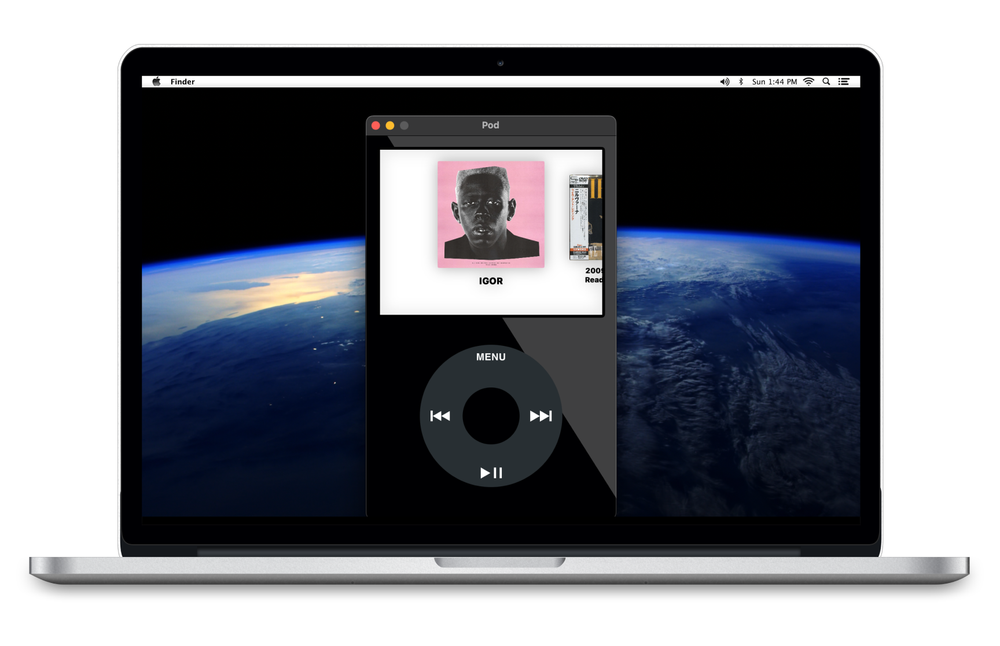

# Pod

The iPod Classic, on your Mac.

<p align="center">
  
</p>

Click wheel, haptic feedback, 40,000+ radio stations, Spotify integration. Free, native, tiny.

[Download for macOS](https://www.desktopipod.com) · [Website](https://www.desktopipod.com) · macOS 12.4+

## Features

- **Click wheel** with smoothed gesture tracking and haptic feedback
- **Local library** — point it at any folder of MP3s; reads ID3 metadata + album art
- **Radio** — 40,000+ stations, searchable, favoritable
- **Spotify** — play your saved albums and playlists, controlled by the wheel (uses [librespot](https://github.com/librespot-org/librespot) under the hood)
- **Now-playing in the menu bar** with media-key support
- **Auto-updates** via [Sparkle](https://sparkle-project.org)

## Build

Standard Xcode project. Open `Pod.xcodeproj` and run.

For Spotify support, the embedded Rust bridge needs to be built:

```bash
cd pod-spotify-bridge
cargo build --release
```

The Swift side picks up the binary automatically when running from Xcode (looks for it at `pod-spotify-bridge/target/release/`).

## Architecture

- **SwiftUI + AppKit hybrid** (`Pod/`) — MVVM, protocol-based wheel input dispatch
- **Rust bridge** (`pod-spotify-bridge/`) — librespot-backed Spotify session, JSON-RPC over stdin/stdout
- **GlobalState singleton** for app-wide state + `UserDefaults` persistence
- See [CLAUDE.md](CLAUDE.md) for a more thorough tour

## Releasing

Pipeline lives in `scripts/release.sh` (Developer ID signing, notarization, Sparkle EdDSA, universal Rust bridge, dmg + zip). See `.claude/skills/release/SKILL.md` for the full procedure.

## License

[PolyForm Noncommercial 1.0.0](LICENSE) — free for personal, hobby, research, and educational use. Commercial use is not permitted.

## Support

Bugs and questions: [support@desktopipod.com](mailto:support@desktopipod.com)
